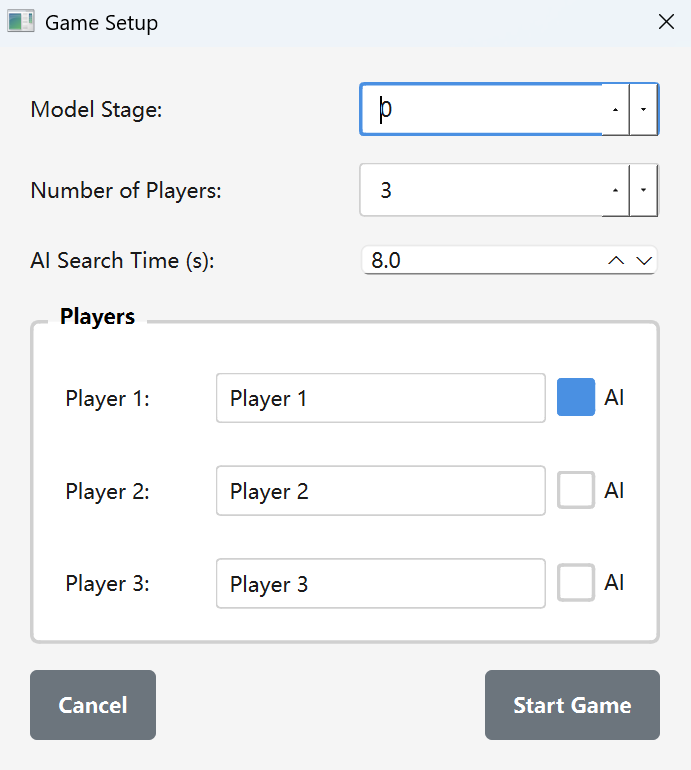
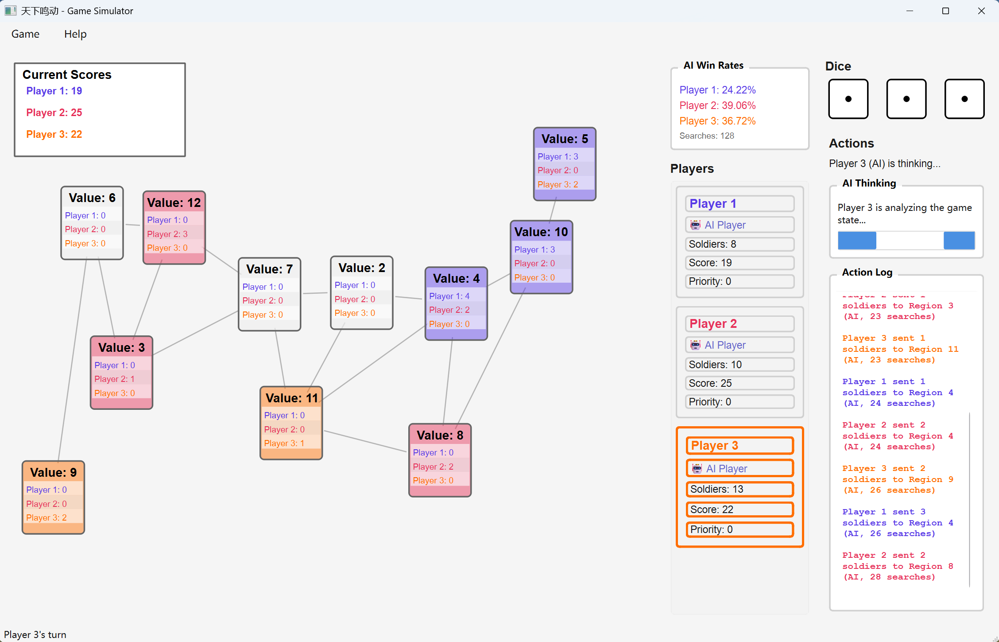

# 天下鸣动模拟器

[English README](../readme.md)

## 安装

您可以使用提供的 `requirements.txt` 文件安装所有必需的依赖包：

```bash
pip install -r requirements.txt
```

或者，您可以手动安装依赖包：

```bash
pip install PyQt6 numpy torch pandas
```

**注意**：PyTorch 的安装可能需要根据您的系统进行额外步骤。如需 GPU 支持，请访问 [PyTorch 官方网站](https://pytorch.org/get-started/locally/) 获取特定平台的安装说明。

## 运行游戏

要启动游戏的图形用户界面，请运行：

```bash
python play_ui.py
```

这将启动设置对话框，您可以在开始游戏前配置游戏参数。

## 游戏界面

### 设置界面

<p align="center">
  
</p>

设置界面允许您在开始游戏前配置游戏参数。您可以设置玩家数量、选择 AI 对手、配置 AI 行为并自定义玩家名称。

### 游戏界面

<p align="center">
  
</p>

主游戏界面显示游戏地图、玩家信息、骰子结果和操作控件。您可以查看所有区域的当前状态、玩家得分和可用操作。

## 游戏配置参数

启动游戏时，您将看到一个设置对话框，可以在其中配置以下参数：

### 模型阶段
- **默认值**：0
- **说明**：确定使用哪个版本的 AI 模型。目前仅提供 0。

### 玩家数量
- **默认值**：3
- **说明**：设置游戏中的玩家总数。这会影响游戏动态、每个玩家的可用兵力和 AI 模型选择。

### AI 搜索时间
- **默认值**：8.0 秒
- **说明**：控制 AI 思考每一步的时间。更高的值通常会产生更好的 AI 决策，但游戏速度会变慢。较低的值使 AI 响应更快，但可能会降低决策质量。

### 玩家配置
对于每个玩家，您可以配置：

- **玩家名称**：玩家的自定义名称（默认为"Player 1"、"Player 2"等）
- **AI 控制**：复选框，用于为该玩家启用 AI 控制。启用后，AI 将自动为该玩家做出决策。禁用后，玩家将由用户手动控制。

## 游戏规则

详细的游戏规则，请参考：
- [English Rules](rules_EN.md)
- [中文规则](rules.CN.md)

